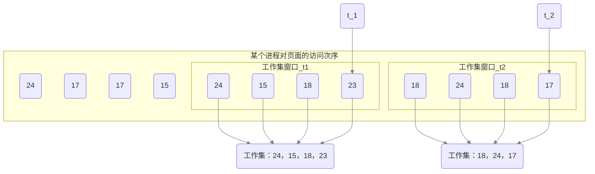

$$虚拟内存管理$$

# 一、虚拟内存的定义

在操作系统的管理下，在用户看来似乎有一个比实际内存大得多的内存，称为 **虚拟内存**。
1. 基于局部性原理，在 **程序装入** 时，仅需将程序 **当前运行要用到的少数页面（或段）装入内存，而将其余部分暂留在外存**，便可启动程序执行。
2. 在 **程序执行过程中**，当所访问的 **信息不在内存时**，由 **操作系统负责将所需信息从外存调入内存**，然后继续执行程序。
   - 这个过程就是 **请求调页（或请求调段）** 功能。
3. 当 **内存空间不够** 时，由 **操作系统负责** 将内存中 **暂时用不到的信息换出到外存**。
   - 这个过程就是 **页面置换（或段置换）** 功能。

- **局部性原理**
  - **高速缓存技术** 所依赖的原理。
    - 快表、页高速缓存、虚拟存储技术都属于 **高速缓存技术**。
  - 局部性原理 **表现在**：
    - **时间局部性**：如果执行了程序中的某条指令，那么不久后这条指令很有可能再次执行；如果某个数据被访问过，不久之后该数据很可能再次被访问。
      - 因为程序中存在着大量的循环操作。

    - **空间局部性**：一旦程序访问了某个存储单元，在不久之后，其附近的存储单元也很有可能被访问。
      - 因为很多数据在内存中都是连续存放的，并且程序的指令也是顺序地在内存中存放的

# 二、虚拟内存的特征

1. **多次性**：无需在作业运行时一次性全部装入内存，而是允许被分成多次调入内存。
2. **对换性**：在作业运行时无需一直常驻内存，而是允许在作业运行过程中，将作业换入、换出。
3. **虚拟性**：从逻辑上扩充了内存的容量，使用户看到的内存容量，远大于实际的容量。

# 三、虚拟内存技术的实现

虚拟存储技术的实现需要建立在 **离散分配** 的内存管理方式基础上。
   - 虚拟内存技术，运行一个作业分多次调入内存。如果采用连续分配方式，会不方便实现。

虚拟内存的实现有三种方式：**请求分页存储管理**、**请求分段存储管理**、**请求段页式存储管理**。

- 虚拟内存的存储管理与传统的非连续分配存储管理的主要区别在于：
   - 在程序执行过程中，当所 **访问的信息不在内存时，由操作系统负责将所需信息从外存调入内存**，然后继续执行程序。即，操作系统要提供 **请求调页（或请求调段）功能**。
   - 若内存空间不够，由操作系统负责 **将内存中暂时用不到的信息换出到外存**。即，操作系统要提供 **页面置换（或段置换）功能**。

- 虚拟内存的实现需要以下 **硬件支持**：
  - **一定容量的内存和外存**。
  - **页表机制（或段表机制）**，作为主要数据结构。
  - **中断机构**，当用户程序要访问的部分尚未调入内存时，则产生中断。
  - **地址变换机构**，逻辑地址到物理地址的变换。

# 四、请求分页管理方式

请求分页系统建立在基本分页系统的基础上，为支持虚拟存储器功能而增加了 **请求调页** 和 **页面置换** 功能。

1. **页表机制**
请求分页系统中，
   - 为实现 **请求调页功能**，操作系统需要知道每个页面 **是否已调入内存**；若未调入，则还需要知道该页 **在外存中的存放位置**。
   - 为实现 **页面置换功能**，操作系统需要通过某些指标来 **决定换出哪个页面**；对于要换出的页面，还要知道其 **是否被修改过**，以决定是否写回外存。

    于是，请求分页系统中的 **页表项** 如下：

    |页号|物理块号|状态位 P|访问字段 A|修改位 M|外存地址|
    |:-:|:------:|:-----:|:--------:|:-----:|:-----:|

    - **状态位 P**：标记该页是否已调入内存，供程序访问时参考。
    - **访问字段 A**：记录本页在一段时间内被访问的次数，或记录本页最近已有多长时间未被访问，供置换算法换出页面时参考。
    - **修改位 M**：标记该页在调入内存后是否被修改过，以决定换出时是否写回外存。
    - **外存地址**：记录该页在外存的存放地址，通常是物理块号，供调入该页时参考。

2. **缺页中断机构**
在请求分页系统中，每当要访问的 **页面不存在** 时，便产生一个 **缺页中断**，然后由操作系统的 **缺页中断处理程序处理中断**。
此时 **缺页的进程阻塞**，放入阻塞队列，调页 **完成后再将其唤醒**，放回就绪队列。
如果内存中 **有空闲块**，则为进程 **分配一个空闲块**，将所缺页面装入该块，并修改页表中相应的页表项。
如果内存中 **没有空闲块**，则 **由页面置换算法选择一个页面淘汰**，若该页面在内存期间 **被修改过**，则要将其 **写回外存**。未修改过的页面不用写回外存。
   - **缺页中断** 是因为当前执行的指令想要访问的目标页面未调入内存而产生的，因此 **属于内中断**。
   - **一条指令** 在执行期间，**可能产生多次缺页中断**。

3. **地址变换机构**
地址变换过程如下：
   1. 先检索快表，若命中，则从相应表项中取出该页的物理块号，并修改页表项中的访问位，已供置换算法换出页面时参考。对于写指令，还需要将修改位置为 1。
   2. 若快表未命中，则要到页表中查找，若找到，则从相应表项中取出物理块号，并将该页表项写入快表，若快表已满，则需采用某种算法替换。
   3. 若在页表中未找到，则需要进行缺页中断处理，请求系统将该页从外存换入内存，页面被调入内存后，由操作系统负责更新页表和快表，并获得物理块号。
   4. 利用得到的物理块号和页内地址拼接形成物理地址，用该地址去访存。
   - 缺页中断处理需要保留 CPU 现场。
   - 换入/换出页面都需要启动慢速的 I/O 操作。如果换入/换出太频繁，会有很大的开销。
   - 页面调入内存后，需要修改慢表，同时也需要将表项复制到快表中。

# 五、页面置换算法

**页面置换算法**：选择调出哪个页面的算法。

常见的页面置换算法有：**最佳置换算法（OPT）**、**先进先出置换算法（FIFO）**、**最近最久未使用置换算法（LRU）**、**时钟置换算法（CLOCK）**、**改进型的时钟置换算法**。
   - 好的页面置换算法应该 **追求更少的缺页率**。

## （一）最佳置换算法（OPT）

**算法思想**：每次选择 **淘汰的页面** 将是 **以后用不使用**，或者 **在最长时间内不再被访问的页面**，这样可以保证最低的缺页率。

*注意*：缺页时未必发生页面置换。若还有可用的空闲内存块，就不用进行页面置换。

- **最佳置换算法缺页率最小，性能最好，但是无法实现的**。最佳置换算法可以保证最低的缺页率，但实际上，只有在进程执行的过程中才能知道接下来会访问到的是哪个页面。操作系统无法提前预判页面访问序列。

## （二）先进先出置换算法（FIFO）

**算法思想**：每次选择 **淘汰的页面** 是 **最早进入内存的页面**。

**实现方法**：把调入内存的页面根据调入的先后顺序排成一个队列，需要换出页面时选择队头页面即可。队列的最大长度取决于系统为进程分配了多少个内存块。

- **优点**：**实现简单**。

- **缺点**：
  - **只有 FIFO 算法会产生 Belady 异常**。
    - **Balady 异常**：当为进程分配的物理块数增大时，缺页次数不减反增的异常现象。
  - **算法性能差**。该算法没有利用局部性原理，与进程实际运行时的规律不适应，因为先进入的页面也有可能最经常被访问。

## （三）最近最久未使用置换算法（LRU）

**算法思想**：每次 **淘汰的页面** 是 **最近最久未使用的页面**。

**实现方法**：赋予每个页面对应的页表项中，用 **访问字段记录该页面自上次被访问以来所经历的时间 t**。当需要淘汰一个页面时，选择现有页面中 t 值最大的，即最近最久未使用的页面。

- **优点**：算法 **性能好**。
- **缺点**：**实现困难、开销大**，需要专门的硬件支持。

## （四）时钟置换算法（COLCK）

**时钟置换算法（CLOCK算法/最近未用算法 NRU）** 是一种性能和开销较均衡的算法。

- **简单的 CLOCK 算法实现方法**：为每个页面设置一个 **访问位**，再将内存中的页面都通过链接指针 **链接成一个循环队列**。
  - 当某页被访问时，其访问位设为 1。
  - 当需要淘汰一个页面时，只需检查页的访问位。
    - 如果是 0，就选择该页换出。
    - 如果时 1，则将它置为 0，暂不换出，继续检查下一个页面。
    - 若第一轮扫描中所有页面都是 1，则将这些页面的访问位依次置为 0后，再进行第二轮扫描。
      - 第二轮扫描一定会有访问位为 0 的页面，因此 **简单的 CLOCK 算法** 选择一个淘汰页面 **最多会经过两轮扫描**。

- **优点**：实现简单，算法开销小。

- **缺点**：**未考虑页面是否被修改过**。**简单的时钟置换算法** 仅考虑到一个页面最近是否被访问过。但如果被淘汰的页面没有被修改过，就不需要只需 I/O 操作写回外存。**只有被淘汰的页面被修改过时，才需要写回外存**。

## （五）改进型的时钟置换算法

1. **算法思想**：除了考虑一个页面最近有没有被访问过之外，操作系统还应考虑页面有没有被修改过。**在其他条件都相同时，应优先淘汰没有修改过的页面**，避免 I/O 操作。

2. **算法实现**：增加一个 **修改位**。
   - **修改位 = 0**，表示页面没有被修改过。
   - **修改位 = 1**，表示页面被修改过。
   - 用 **（访问位，修改位）** 的形式表示各页面状态。
   - 将所有可能被置换的页面排成一个循环队列
   - 第一轮：从当前位置开始扫描到第一个（0，0）的帧用于替换。本轮扫描不修改任何标志位。（**第一优先级：最近没访问，且没修改的页面**）
   - 第二轮：若第一轮扫描失败，则重新扫描，查找第一个（0，1）的帧用于替换。本轮将所有扫描过的帧访问位设为 0。（**第二优先级：最近没访问，但修改过的页面**）
   - 第三轮：若第二轮扫描失败，则重新扫描，查找第一个（0，0）的帧用于替换。本轮扫描不修改任何标志位。（**第三优先级：最近访问过，但没修改的页面**）
   - 第四轮：若第三轮扫描失败，则重新扫描，查找第一个（0，1）的帧用于替换。（**最近访问过，且修改过的页面**）
 - 由于第二轮已将所有帧的访问位设为 0，因此经过第三轮、第四轮扫描一定会有一个帧被选中，因此 **改进型 CLOCK 置换算法** 选择一个淘汰页面 **最多会进行四轮扫描**。

- **优点**：
  - 可减少磁盘的 I/O 操作次数。
  - 算法开销小，性能好。

- **缺点**：相比与简单 CLOCK 算法，开销有所增加。

# 六、页框分配

## （一）驻留集

**驻留集** 指请求分页存储管理中给进程分配的页框（内存块/物理块）的集合。
  - 在采用了虚拟存储技术的系统中，驻留集大小一般小于进程的总大小。
  - 若驻留集太小，会导致缺页频繁，系统要花大量的时间来处理缺页，实际用于进程推进的时间很少。
  - 若驻留集太大，会导致多道程序并发度下降，资源利用率降低。

## （二）页面分配策略

请求分页系统中，可采取 **两种内存分配策略**：
1. **固定分配**：操作系统为每个进程分配一组固定数目的物理块，在进程运行期间不再改变。即，**驻留集大小不变**。
2. **可变分配**：先为每个进程分配一定数目的物理块，在进程运行期间，可根据情况做适当的增加或减少。即，**驻留集大小可变**。

## （三）页面置换策略

请求分页系统中，可采取 **两种置换策略**：
1. **局部置换**：发生缺页时只能选进程自己的物理块进行置换。
2. **全局置换**：可以将操作系统保留的空闲物理块分配给缺页进程，也可以将别的进程持有的物理块置换到外存，再分配给缺页进程。

## （四）内存分配策略
通过页面分配策略和页面置换策略可以组合出三种 **内存分配策略**：**固定分配局部置换**、**可变分配全局置换**、**可变分配局部置换**。

**注意**：全局置换意味着一个进程拥有的物理块数量必然会改变，因此不可能是与固定分配组合。

1. **固定分配局部置换**：系统为进程分配一定数量的物理块，在整个运行期间都不改变。若进程在运行中发生缺页，则只能从该进程在内存中的页面中选出一页换出，然后再调入需要的页面。
   - **缺点**：难以确定应为每个进程分配的物理块数量。太少会频繁出现缺页中断，太多又会降低 CPU 和其他资源的利用率。

2. **可变分配全局置换**：
   - 刚开始会为每个进程分配一定数量的物理块。操作系统会保持一个空闲物理块队列。
   - 当进程发生缺页时，从空闲物理块中取出一块分配给进程；
   - 若已无空闲物理块，则可选择一个 **未锁定** 的页面换出外存，再将该物理块分配给缺页的进程。
   - 采用这种策略时，**只要某进程发生缺页，都将获得新的物理块**，仅当空闲物理块用完时，系统才选择一个未锁定的页面调出。被选择的页可能是系统中任何一个进程中的页，因此这个 **被选中的进程拥有的物理块会减少，缺页率会增加**。
   - 即，**只要缺页就给分配新物理块**。
   - **优点**：比固定分配局部置换更灵活，可以动态增加进程的物理块。
   - **缺点**：会盲目地给进程增加物理块。**导致系统多道程序的并发能力下降**。

3. **可变分配局部置换**：
   - 刚开始会为每个进程分配一定数量的物理块。
   - 当某进程发生缺页时，只允许从该进程自己的物理块中选出一个进行换出外存。
   - 如果进程在运行中频繁地缺页，系统会为该进程多分配几个物理块，直至该进程缺页率趋于适当程度；
   - 反之，如果进程在运行中缺页率特别低，则可适当减少分配给该进程的物理块。
   - 即，**要根据发生缺页的频率来动态地增加或减少进程的物理块**。
   - **优点**：保证进程不会过多地调页的同时，也保持了系统的多道程序并发能力。
   - **缺点**：需要更复杂的实现，更大的开销。

## （五）调入页面的时机

确定系统将进程运行时所缺的页面调入内存的时机，可以采取两种 **调页策略**：**预调页策略**、**请求调页策略**。

1. **预调页策略**：根据局部性原理，一次调入若干个相邻的页面可能比一次调入一个页面更高效。但如果提前调入的页面中大多数都没被访问过，则又是低效的。因此可以 **预测不久之后可能访问到的页面，将它们预先调入内存**，但目前预测成功率只有 $50 \%$ 左右。故这种策略 **主要用于进程的首次调入（运行前调入）**，由程序员指出应该先调入哪些部分。

2. **请求调页策略**：进程 **在运行期间发现缺页时才将所缺页面调入内存（运行时调入）**。由这种策略调入的页面一定会被访问到，但由于每次只能调入一页，而每次都要磁盘 I/O 操作，因此 I/O 开销较大。

## （六）从何处调入页面

- 请求分页系统中的 **外存** 分为两个部分：
  - **文件区**：用于存放文件。采用离散分配方式。
  - **对换区（交换区）**：用于存放对换页面。采用连续分配方式。磁盘 I/O 速度比文件区更快。

发生缺页请求时，系统从何处将缺页调入内存分为 **三种情况**：
1. **系统拥有足够的对换区空间**
   - 可以全部从对换区调入所需页面，以提高调页速度。
   - 在程序运行前，需要将与该进程有关的文件从文件区复制到对换区。

2. **系统缺少足够的对换区空间**
   - 凡是不会被修改的数据都直接从文件区调入，由于这些页面不会被修改，因此换出时不必写回磁盘，下次需要时再从文件区调入即可。
   - 对于可能被修改的部分，换出时需写回磁盘对换区，下次需要时再从对换区调入。

3. **UNIX 方式**
   - 运行之前将进程有关的数据全部放在文件区。
   - 故未使用过的页面，都可从文件区调入。
   - 若被使用过的页面需要换出，则写回对换区，下次需要时从对换区调入。

# 七、抖动（颠簸）

**抖动（颠簸）**：刚刚换出的页面马上又要换入内存，刚刚换入的页面马上又要换出内存，这种频繁的页面调度行为称为抖动。

产生抖动的 **主要原因**：进程频繁访问的页面数目高于可用的物理块数（**分配给进程的物理块不够**）。

# 八、工作集

为了研究应该为每个进程分配多少个物理块（驻留集），提出了工作集的概念。

**工作集** 指在某段时间间隔里，进程实际访问页面的集合。

- **工作集 W** 由 **时间 t** 和 **工作集窗口尺寸 $\Delta$** 确定。

- 实际应用中，工作集窗口会设置得很大，对于局部性好的程序，**工作集大小一般会比工作集窗口 $\Delta$ 小很多**。

- 工作集反映了 **进程在接下来一段时间内很有可能频繁访问的页面集合**。
  - 所以 **驻留集大小不能小于工作集大小，否则进程在运行过程中会频繁缺页**。

# 九、内存映射文件

**内存映射文件（Memory-Mapped Files）** 是操作系统向上层程序员提供的功能（系统调用）。
  - 进程可以使用系统调用，请求操作系统将文件映射到进程的虚拟地址空间。
  - 以访问内存的方式读写文件
  - 进程关闭文件时，操作系统负责将文件数据写回磁盘，并解除内存映射。
  - 多个进程可以映射同一个文件，方便共享。

- **优点**：
  - 方便程序员访问文件数据。已建立映射的文件，只需按访问内存的方式读写即可。
  - 文件数据的读入/写出完全由操作系统负责，I/O 效率可以由操作系统负责优化。
  - 方便多个进程共享同一个磁盘文件。
    - **共享内存** 是通过映射相同文件到通信进程的虚拟地址空间来实现的。
    - 多个进程映射到同一个文件时，各进程的虚拟地址空间都是相互独立的。但操作系统会将对应的虚拟空间映射到相同的物理内存（用页表实现）。
    - 一个进程在共享内存上完成了写操作，另一个映射到这个文件的虚拟地址空间上的进程进行读操作时，立刻就能看到更改的结果。