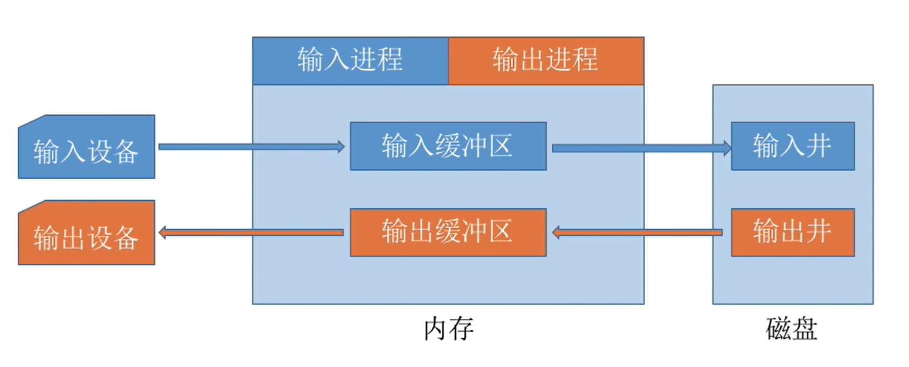
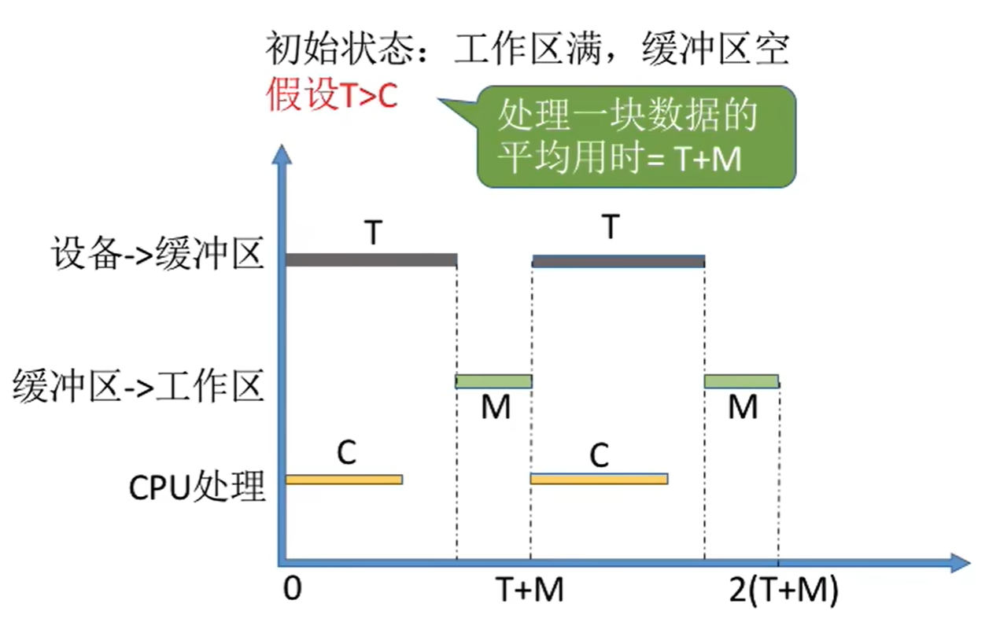
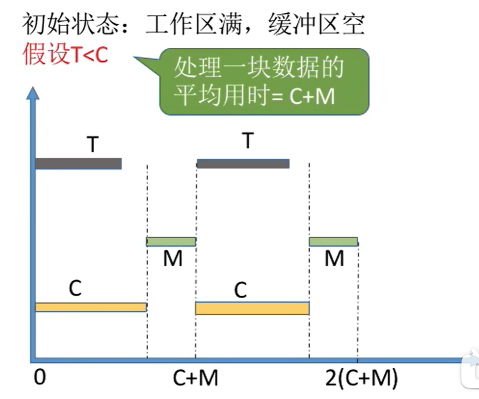
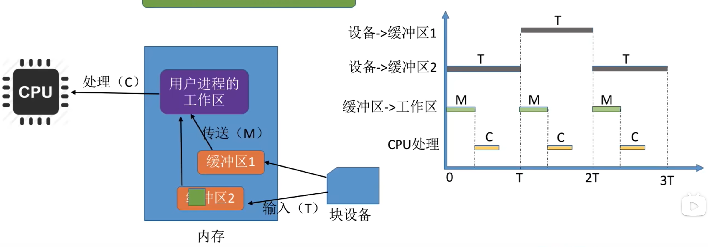
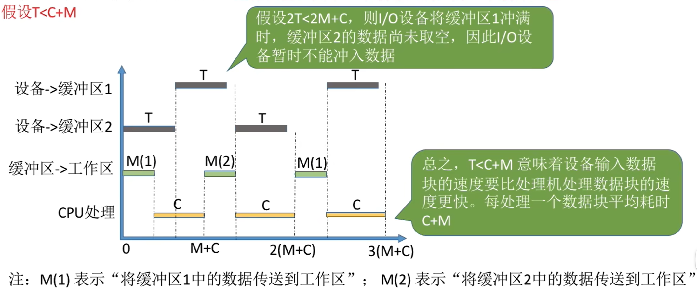
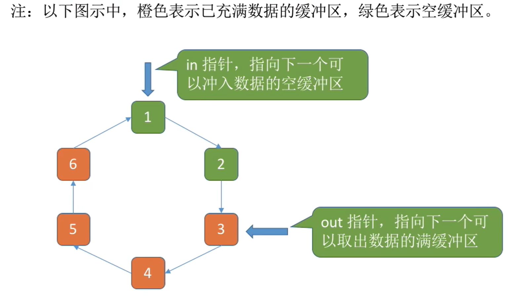
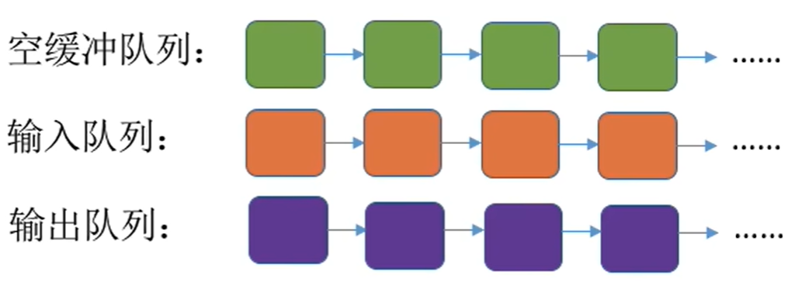
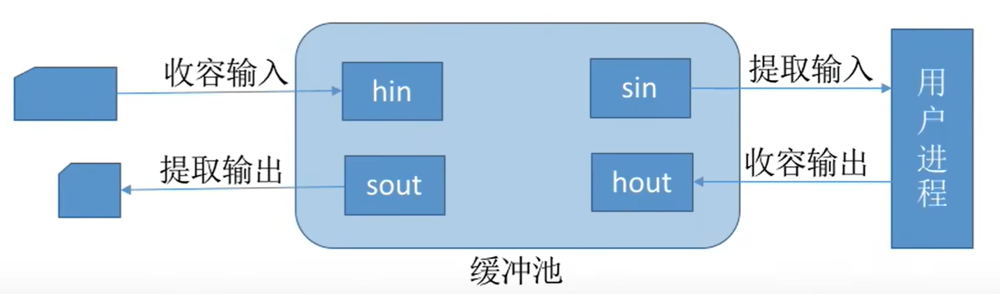

<font size = 9>$$I/O 核心子系统$$</font>


**I/O 核心子系统（I/O 系统）** 要实现的功能就是 **设备独立性软件**、**设备驱动程序**、**中断处理程序** 要实现的功能。主要有 **I/O 调度**、**设备保护**、**假脱机技术（SPOOLing 技术）**、**设备分配与回收**、**缓冲区管理（即缓冲与高速缓存）**。

- **假脱机技术（SPOOLing 技术）** 要在 **用户层软件** 实现。

- **I/O 调度、设备保护、设备分配与回收、缓冲区管理** 要在 **设备独立性软件** 实现。

# 一、I/O 调度

**用某种算法确定一个好的顺序来处理各个 I/O 请求**。


# 二、设备保护
- 操作系统需要实现 **文件保护功能**，不同的用户对各个文件有不同的访问权限。
- 在 UNIX 系统中，**设备被看做是一种特殊的文件**，每个设备也会有相应的 FCB。当用户请求访问某个设备时，系统根据 FCB 中记录的信息来判断该用户是否有相应的访问权限，以此实现“设备保护”的功能。


# 三、SPOOLing 技术（假脱机技术）

**假脱机技术（SPOOLing 技术）** 是用软件的方式模拟脱机技术。

- SPOOLing 技术可以把一台物理设备 **虚拟** 成逻辑上的多台设备，**可将独占式设备改造成共享设备**。

- SPOOLing 技术是一种 **以空间换时间** 的技术。

1. **脱机输入/输出技术**
    批处理阶段引入了 **脱机输入/输出技术**（用磁带完成）。
    ```mermaid
        graph LR
            1(用户) ==> 2(慢速输入设备) ==> 3(外围控制机) ==> 4(磁带) ==> 5(CPU) ==> 6(磁带) ==> 7(类似外围控制机的设备) ==> 8(慢速输出设备)

        linkStyle 0,1,2,3,4,5,6 stroke:white
    ```

    - 在外围控制机的控制下，慢速输入设备的数据先被输入到更快速的磁带上。之后主机可以从快速的磁带上读入数据，从而缓解速度矛盾。

    - 引入脱机技术后，缓解了 CPU 与慢速 I/O 设备的速度矛盾，实现预输入、缓输出。即使 CPU 在忙碌，也可以提前将数据输入到磁带；即使慢速的输出设备正在忙碌，也可以提前将数据输出到磁带。

    - 脱机：脱离主机的控制进行的输入/输出操作。

2. **SPOOLing 系统的组成**
    {width="600"}
    1. **输入井** 和 **输出井**
       - 在磁盘上开辟出的两个存储区域。
       - **输入井**：模拟脱机输入时的磁带，用于收容 I/O 设备输入的数据。
       - **输出井**：模拟脱机输出时的磁带，用于收容用户进程输出的数据。
       - 一个进程的输入（输出）数据保存为一个文件，所有进程的输入（输出）文件链接成一个输入（输出）队列。
    2. **输入进程** 和 **输出进程**
       - **输入进程**：模拟脱机输入时的外围控制机。
         - 将用户要求的数据从输入设备传送到输入缓冲区，再存放到输入井中。
         - 当 CPU 需要输入数据时，直接从输入井读入内存。
       - **输出进程**：模拟脱机输出时的外围控制机。
         - 将用户要求输出的数据从内存传送到输出井，待输出设备空闲时，再将输出井中的数据经缓冲区输出至输出设备。
       - 要实现 SPOOLing 技术，**必须要多道程序技术的支持**。系统会建立“输入进程”和“输出进程”。
    3. **输入缓冲区** 和 **输出缓冲区**
       - 在内存中开辟出的两个存储区域。
       - **输入缓冲区**：用于暂存有输入设备送来的数据，以后再传送到输入井。
       - **输出缓冲区**：用于暂存从输出井送来的数据，以后再传送到输出设备。
    4. **井管理程序**
         - 用于控制作业与磁盘井之间信息的交换。

3. **SPOOLing 系统的特点**
   - 提高了 I/O 速度。缓和了 CPU 和低速 I/O 设备之间速度不匹配的矛盾。
   - 将独占设备改造为共享设备。
   - 实现了虚拟设备功能。对每个进程而言，它们都认为自己独占了一台设备。


# 四、设备的分配与回收

**设备分配** 是根据用户的 I/O 请求分配所需的设备。


## 1. 设备分配时应考虑的因素

设备分配时因考虑 **设备的固有属性**、**设备分配算法**、**设备分配中的安全性**。

1. **设备的固有属性**
设备的固有属性可分成三种：**独占设备**、**共享设备**、**虚拟设备**。对它们应采取不同的分配策略。

   - **独占设备**：一个时段只能分配给一个进程。
   - **共享设备**：可同时分配给多个进程使用。
     - 各进程往往是宏观上同时共享使用设备，而微观上交替使用。
     - 需要合理调度各个进程访问该设备的先后次序。
   - **虚拟设备**：采用 SPOOLing 技术将独占设备改造成虚拟设备的共享设备，可同时分配给多个进程使用。

2. **设备分配算法**
针对设备分配，通常至采用两种分配算法：**FCFS 算法** 和 **最高优先级优先算法**。

   - **FCFS 算法** 根据各个进程对某个设备提出请求的先后次序，将这些进程排成一个设备请求队列，设备分配程序总是将设备首先分配给队首进程。
   - **最高优先级优先算法** 在形成设备队列时，优先级高的进程排在设备队列前面，而对于优先级相同的 I/O 请求，则按 FCFS 原则排队。

3. **设备分配中的安全性**
从进程运行的 安全性（在设备分配中应防止方式进程死锁）上考虑，设备分配有两种方式：**安全分配方式** 和 **不安全分配方式**。
   - **安全分配方式**：为进程分配一个设备后就将进程阻塞，本次 I/O 完成后才将进程唤醒。
     - 一个时段内每个进程只能使用一个设备。
     - **优点**：破坏了“请求和保持”条件，不会死锁。
     - **缺点**：对一个进程来说，CPU 和 I/O 设备只能串行工作。
   - **不安全分配方式**：进程发出 I/O 请求后，系统为其分配 I/O 设备，进程可继续执行，之后还可以发出新的 I/O 请求。只有某个 I/O 请求得不到满足时才将进程阻塞。
     - 一个进程可以同时使用多个设备。
     - **优点**：进程的计算任务和 I/O 任务可以并行处理，使进程迅速推进。
     - **缺点**：有可能发生死锁（可以死锁避免、死锁的检测和解除）。


## 2. 分配方式

- **静态分配**：进程运行前为其分配全部所需资源，运行结束后归还资源。
  - 破坏了“请求和保持”条件，不会发生死锁。

- **动态分配**：进程运行过程中动态申请设备资源。


## 3. 设备分配的数据结构

系统中，可能存在多个通道，每个通道可以连接多个设备控制器，每个设备控制器可以连接多个物理设备。**设备分配的数据结构** 需要体现这种从属关系，有 **设备控制表（DCT）**、**控制器控制表（COCT）**、**通道控制表（CHCT）**、**系统设备表（SDT）**。

1. **设备控制表（DCT）**：系统为每个设备配置一张 DCT，用于记录设备情况。表中的表项就是设备的各个属性。

   |设备控制表（DCT）|
   |:--------------:|
   |设备类型|
   |设备标识符|
   |设备状态|
   |指向控制器表的指针|
   |重复执行次数或时间|
   |设备队列的队首指针|
   - **设备类型**：即逻辑设备名，表示设备类型，如打印机、键盘等。
   - **设备标识符**：物理设备名，系统中的每个设备的物理设备名唯一。
   - **设备状态**：表示当前设备的状态（忙/闲）。
     - 当某进程释放某个设备，且无其他进程请求该设备时，系统将该设备 DCT 中的设备状态改为空闲。
   - **指向控制器表的指针**：每个设备有一个控制器控制，该指针指向对应的控制器表。
   - **重复执行次数或时间**：当重复执行多次 I/O 操作后仍不成功，才认为此次 I/O 失败。
   - **设备队列的队首指针**：指向正在等待该设备的进程队列（由进程 PCB 组成）的队首。

2. **控制器控制表（COCT）**：每个设备控制器都对应一张 COCT，操作系统根据 COCT 的信息对控制器进行操作和管理。

   |控制器控制表（COCT）|
   |:--------------:|
   |控制器标识符|
   |控制器状态|
   |指向通道表的指针|
   |控制器队列的队首指针|
   |控制器队列的队尾指针|
   - **控制器标识符**：各个控制器的唯一 ID。
   - **控制器状态**：表示当前控制器的状态（忙碌/空闲/故障）。
   - **指向通道表的指针**：每个控制器由一个通道控制，该指针可找到相应通道的信息。
   - **控制器队列的队首/尾指针**：指向正在等待该控制器的进程队列（由进程 PCB 组成队列）的队首/尾。

3. **通道控制器表（CHCT）**：每个通道都会对应一张 CHCT。操作系统根据 CHCT 的信息对通道进行操作和管理。

   |通道控制表（CHCT）|
   |:--------------:|
   |通道标识符|
   |通道状态|
   |与通道连接的控制器表首址|
   |通道队列的队首指针|
   |通道队列的队尾指针|
   - **通道标识符**：各个通道的唯一 ID。
   - **通道状态**：表示当前通道的状态（忙碌/空闲/故障）。
   - **与通道连接的控制器表首址**：一个通道可以尾多个控制器服务，可通过该指针找到该通道管理的所有控制器相关信息（COCT）。
   - **通道队列的队首/尾指针**：指向正在等待该通道的进程队列（由进程 PCB 组成队列）的队首/尾。

4. **系统设备表（SDT）**：记录了 **系统中全部设备** 的情况，每个设备对应一个表目。

   |系统控制表（SDT）|
   |:--------------:|
   |表目 1|
   |表目 2|
   |...|
   |表目 i|
   |...|

   |表目 i|
   |:--------------:|
   |设备类型|
   |设备标识符|
   |DCT（设备控制表）|
   |驱动程序入口|
   - **设备类型**：表示设备类型，如：打印机、键盘等。
   - **设备标识符**：物理设备名，系统中的每个设备的物理设备名唯一。
   - **整个系统中只有一张 SDT**。


## 4. 设备分配的具体步骤

1. 根据进程请求的 **物理设备名** 查找 SDT。
   - 物理设备名是进程请求分配设备时提供的参数。

2. 根据 SDT 找到 DCT，若 **设备** 忙碌则将进程 PCB 挂到 **设备等待队列** 中，不忙碌则将 **设备** 分配给进程。

3. 根据 DCT 找到 COCT，若 **控制器** 忙碌则将进程 PCB 挂到 **控制器等待队列** 中，不忙碌则将 **控制器** 分配给进程。

4. 根据 COCT 找到 CHCT，若 **通道** 忙碌则将进程 PCB 挂到 **通道等待队列** 中，不忙碌则将 **通道** 分配给进程。

**注意：只有设备、控制器、通道三者都分配成功时，这次设备分配才算成功，之后便可启动 I/O 设备进行数据传送。**

- **缺点**：
  - 用户编程时必须使用“物理设备名”，低层细节对用户不透明，不方便编程。
  - 若换了一个物理设备，则程序无法运行。
  - 若进程请求的物理设备正在忙碌，则即使系统中还有同类型的设备，进程也必须阻塞等待。

- **改进方法**：建立逻辑设备名与物理设备名的映射机制，用户编程时只需提供逻辑设备名。
  1. 根据进程请求的 **逻辑设备名** 查找 SDT。
     - **用户编程时提供的逻辑设备名其实就是“设备类型”**。

  2. 查找 SDT，找到用户进程 **指定类型的、并且空闲** 的设备，将其分配给该进程。操作系统 **在逻辑设备表（LUT）中新增一个表项**。
     - **逻辑设备表（LUT）建立了逻辑设备名与物理设备名之间的映射关系**。
     - **逻辑设备表（Logical Unit Table，LUT）** 的每个表项包含 **逻辑设备名**、**物理设备名**、**设备驱动程序的入口地址**。
         |逻辑设备名|物理设备名|驱动程序入口地址|
         |:-------:|:-------:|:-------------:|
     - 某用户进程第一次使用设备时，使用逻辑设备名向操作系统发出请求，操作系统根据用户进程指定的设备类型查找系统设备表，找到一个空闲设备分配给进程，并在 LUT 中增加相应表项。
     - **如果之后用户进程再次通过相同的逻辑设备名请求使用设备，则操作系统通过 LUT 表即可直到用户进程实际要使用的是哪个物理设备了，并且也能知道该设备的驱动程序入口地址。**
     - 逻辑设备表 LUT 由两种设置方法：
       - 整个系统中只有一张 LUT：各个用户所用的 **逻辑设备名不允许重复**，适用于单用户操作系统。
       - 每个用户一张 LUT：**不同用户的逻辑设备名可重复**，适用于多用户操作系统。

  1. 根据 DCT 找到 COCT，若 **控制器** 忙碌则将进程 PCB 挂到 **控制器等待队列** 中，不忙碌则将 **控制器** 分配给进程。

  2. 根据 COCT 找到 CHCT，若 **通道** 忙碌则将进程 PCB 挂到 **通道等待队列** 中，不忙碌则将 **通道** 分配给进程。


# 五、缓冲区管理

## （一）缓冲区的概念
**缓冲区（Buffer）** 是一个存储区域，可以由专门的硬件寄存器组成，也可以利用内存作为缓冲区。

- 使用 **硬件作为缓冲区** 的 **成本较高**，**容量也较小**，一般仅用在对速度要求非常高的场合。
- 一般情况下，更多的是利用 **内存作为缓冲区**，“设备独立性软件”的缓冲区管理就是要组织管理好这些缓冲区。


## （二）缓冲区的功能

1. 缓和 CPU 与 I/O 设备之间速度不匹配的矛盾。

2. 减少对 CPU 的中断频率，放宽对 CPU 中断响应时间的限制。

3. 解决基本数据单元大小（数据粒度）不匹配的问题。
   - 比如：输出进程每次可以生成一块数据，但 I/O 设备每次只能输出一个字符。

4. 提高 CPU 与 I/O 设备之间的并行性。


## （三）缓冲技术

根据系统设置缓冲区的个数，缓冲技术分为 **单缓冲**、**双缓冲**、**循环缓冲**、**缓冲池**。


### 1. 单缓冲

采用 **单缓冲** 策略时，某用户进程请求某块设备读入若干块的数据，操作系统会 **在主存中为其分配一个缓冲区**。（缓冲区的大小一般就是一个块）

- **注意**：
   - 缓冲区是共享资源，使用时必须互斥。
   - **当缓冲区数据非空时，不能往缓冲区冲入数据，只能从缓冲区把数据传出。**
   - **当缓冲区为空时，可以往缓冲区冲入数据，但必须把缓冲区充满以后，才能从缓冲区把数据传出。**

- 单缓冲的 **工作时间计算**：
  - 在块设备输入时，假定
    - 从设备将一块数据输入缓冲区的时间为 T
    - 操作系统将该缓冲区中的数据传送到工作区的时间为 M
    - CPU 对这一块数据进行处理的时间为 C
    - *注意*：
      - 必须等缓冲区装满后才能从缓冲区中取出数据。
      - 单缓冲区中，T 和 C 可以并行。
  - 当 **T > C** 时
    - CPU 处理完一块数据后，暂时不能将下一块数据传送到工作区，必须等待缓冲区装满数据，再将下一块数据从缓冲区传送到工作区。
    - 处理一块数据的平均用时 = T + M
      {width="600px"}
  - 当 **T < C** 时
    - 缓冲区中装满数据后，暂时不能继续送入下一块数据，必须等待 CPU 处理完上一块数据，再将下一块数据从缓冲区传送到工作区。
    - 处理一块数据的平均用时 = C + M
      {width="600px"}
  - **采用单缓冲策略，处理一块数据平均耗时 $Max(C,T) + M$**。


### 2. 双缓冲

采用 **双缓冲** 策略时，某用户进程请求某块设备读入若干块的数据，操作系统会 **在主存中为其分配两个缓冲区**。（缓冲区的大小一般就是一个块）

- 当设备输入数据时，先将数据送入缓冲区 1，装满后便转向缓冲区 2。
- 操作系统可以从缓冲区 1 中取出数据，送入用户进程，并由 CPU 对数据进行处理。
- 当缓冲区 1 中取出的数据处理完后，若缓冲区 2 已装满，则操作系统又从缓冲区 2 中取出数据送入用户进程处理。
- 设备又可开始将数据送入 缓冲区 1。

- 双缓冲的 **工作时间计算**：
  - 在块设备输入时，假定
    - 从设备将一块 **数据输入缓冲区** 的时间为 **T**
    - 操作系统将该缓冲区中的 **数据传送到工作区** 的时间为 **M**
    - CPU 对这一块数据进行 **处理** 的时间为 **C**
    - *注意*：
      - 必须等缓冲区装满后才能从缓冲区中取出数据。
      - 双缓冲区中，C 和 M 可以与 T 并行。
  - 当 **$T > C + M$** 时
    - 缓冲区 1 是空的，缓冲区 2 是满的。
    - 缓冲区 2 开始向工作区传送数据，缓冲区 1 开始装入数据。
    - 缓冲区 1 还未装满，就必须等待缓冲区 1 装满数据后，才能将下一块数据从缓冲区 1 传送到工作区。
    - 传送并处理的时间 = C + M。
    - 处理一块数据的平均用时 = T。
      {width="600px"}
  - 当 **$T < C + M$** 时
    - 缓冲区 1 时空的，缓冲区 2 是满的。
    - 缓冲区 2 开始向工作区传送数据，缓冲区 1 开始装入数据。
    - 缓冲区 1 装满数据的时间为 T，必须等待缓冲区 2 中的数据传送并处理完后，才能将下一块数据从缓冲区 1 传送到工作区。
    - 处理一个数据块的平均用时 = C + M。
      {width="600px"}
  - **采用双缓冲策略，处理一个数据块的平均耗时为 $Max(T,C + M)$**。

- **使用单/双缓冲在通信时的区别**：两台机器之间通信时，可以配置缓冲区用于数据的发送和接受。
  - 若两个相互通信的机器都只设置单缓冲区，在任一时刻只能实现数据的单向传输，而绝不允许双方同时向对方发送数据。
  - 若两个相互通信的机器都设置双缓冲区，一个用作发送缓冲区，一个用作接受缓冲区，则同一时刻可以实现双向的数据传输。


### 3. 循环缓冲

**循环缓冲区** 将多个 **大小相等** 的缓冲区链接成一个 **循环队列**。

- 双缓冲区机制中，如果输入与输出的速度相差甚远，则双缓冲区的效果不会太理想。于是，引入 **多缓冲** 机制。

- 橙色表示已装满数据的缓冲区。

- 绿色表示空缓冲区。

- 每个缓冲区中有一个链接指针指向下一个缓冲区，最后一个缓冲区指针指向第一个缓冲区，多个缓冲区链接成一个循环队列。

- **in 指针** 指向第一个可以输入数据的空缓冲区。

- **out 指针** 窒息哪个第一个可以提取数据的满缓冲区。

- 输入/输出时，in 和 out 指针沿链接方向循环移动。

   {width="600px"}


### 4. 缓冲池

**缓冲池** 是包含一个用于管理自身的数据结构和一组操作函数的管理机制，用于管理多个缓冲区。

- 缓冲池可供多个进程共享使用。

- 缓冲池由多个系统中共用的缓冲区组成。这些缓冲区按 **使用状况可以分为**：
  - **空缓冲队列**：由空缓冲区链接而成的队列。
  - **输入队列**：由装满输入数据的缓冲区链接而成的队列。
  - **输出队列**：由装满输出数据的缓冲区链接而成的队列。
   {width="500px"}

- 根据一个缓冲区在实际运算中的功能不同，设置了 **四种工作缓冲区**：
  - **hin**：用于收容输入数据的工作缓冲区。
  - **sin**：用于提取输入数据的工作缓冲区。
  - **hout**：用于收容输出数据的工作缓冲区。
  - **sout**：用于提取输出数据的工作缓冲区。

- 缓冲池中的缓冲区有 **四种工作方式**：
  - **收容输入**：输入进程需要输入数据时，从空缓冲队列的队首摘下一个空缓冲区，作为收容输入工作缓冲区，然后将数据输入其中，装满后再将它挂到输入队列的队尾。
  - **提取输入**：计算进程想要取得一块输入数据时，从输入队列的队首取得一个缓冲区，作为提取输入工作缓冲区，从中提取数据，用完该数据后将它挂到空缓冲队列的队尾。
  - **收容输出**：计算进程需要输出数据时，从空缓冲队列的队首取得一个空缓冲区，作为收容输出工作缓冲区，当其中装满数据后，再将它挂到输出队列的队尾。
  - **提取输出**：输出进程请求输出数据时，从输出队列的队首取得一个装满输出数据的缓冲区，作为提取输出工作缓冲区，当数据提取完后，再将它挂到空缓冲队列的队尾。
   {width="500px"}


# 六、磁盘高速缓存（Disk Cache）

**磁盘高速缓存技术** 利用内存中的存储空间来暂存从磁盘中读出的一系列盘块中的信息。

- 磁盘高速缓存 **逻辑上** 属于磁盘，**物理上** 时驻留在内存中的盘块。

- 磁盘高速缓存技术可以提高磁盘的 I/O 速度，对访问高速缓存要比访问原时磁盘数据更为高效。

- 磁盘高速缓存在内存中分为两种形式：
  - 在内存中开辟一个单独的空间作为缓存区，大小固定。
  - 将未利用的内存空间作为一个缓冲池，供请求分页系统和磁盘 I/O 时共享。

- **高速缓存与缓冲区的对比**
  - **相同点**：都介于高速设备和低速设备之间。
  - **区别**：
    - **高速缓存存放的数据**：高速缓存存放的是 **低速设备上的** 某些数据的 **复制数据**。即，高速缓存上有的，低速设备上必然有。
    - **缓冲区存放的数据**：缓冲区存放的是 **低速设备传递给高速设备的数据（或相反）**，而这些数据在低速设备（或高速设备）上不一定有备份。这些数据再从缓冲区传送到高速设备（或低速设备）。
    - **高速缓存的目的**：高速缓存存放的是 **高速设备经常要访问的数据**。若高速设备要访问的数据不再高速缓存中，则高速设备需要访问低速设备。
    - **缓冲区的目的**：高速设备和低速设备的 **通信都要经过缓冲区**。高速设备永远不会直接去访问低速设备。