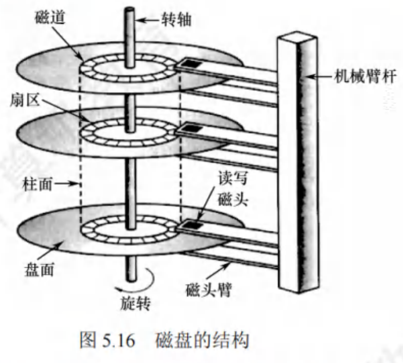

$$磁盘和固态硬盘$$

# 一、磁盘的结构

1. **磁盘** 是表面涂有磁性物质的物理盘片，可以用这些磁性物质来记录二进制数据，通过一个 **磁头**（导体线圈）从磁盘存取数据。

2. **磁道**：是磁盘盘面上的一组同心圆。每个磁道与磁头一样宽。一个盘面上有上千个磁道。

3. 磁道划分为几百个 **扇区**，每个扇区固定存储大小（如1KB）。
   - 一个扇区就是一个 **盘块（磁盘块）**。
   - 扇区是磁盘可寻址的最小单位。

4. **磁道间隙、扇区间隙**：相邻磁道及相邻扇区之间通过一定的间隙分隔开，以避免精度错误。

- 最内侧磁道上的扇区面积最小，因此数据密度最大。
  - 磁盘的存储能力受限于最内道的最大记录密度。
    
    

    {width="300px"}
    

5. 磁盘安装在一个 **磁盘驱动器** 中，由 **磁头臂**、**转轴**（用于旋转磁盘）、**电子设备**（用于数据输入/输出）组成。
   - 多个盘片垂直堆叠，组成磁盘组。
   - 每个盘面对应一个磁头。
   - 一个盘片可能会有两个盘面。
   - 所有磁头固定在一起，连接在同一个磁臂上，与磁盘中心的距离相同，只能“共进退”。
   - 所有盘片上相对位置相同的磁道组成 **柱面**。
    

    {width="300px"}
    

- 磁盘上能存储的 **物理块数目** 由 **扇区数、磁道数、磁盘面数** 决定。

# 二、磁盘的物理地址

**磁盘的物理地址** 用 **（柱面号，盘面号，扇区号）** 表示，来定位任意一个磁盘块。

- 读取地址连续的磁盘块时，采用（柱面号，盘面号，扇区号）的地址结构可以减少磁头移动消耗的时间。

# 三、磁盘中读/写数据

**读/写磁盘数据块** 时需要：
  1. 根据柱面号移动磁头臂，让磁头移动到对应的柱面；
  2. 激活对应盘面的磁头；
  3. 当磁盘旋转时，指定的扇区会从磁头下面划过，从而完成对指定扇区的读/写。

# 四、磁盘的分类

1. 根据 **磁头是否可移动** 可分为：
   1. **活动头磁盘**：磁头可以移动的磁盘。磁头臂可以来回伸缩定位磁道。
   2. **固定头磁盘**：磁头不可移动的磁盘。每个磁道都有一个磁头。

2. 根据 **盘片是否可更换** 可分为：
   1. **可换盘磁盘**：盘片可移动和替换的磁盘。
   2. **固定盘磁盘**：盘片不可更换，永久固定在磁盘驱动器内的磁盘。

3. **温彻斯特磁盘**：最早的磁盘。是一种磁头活动而盘片固定的磁盘存储器。

# 五、磁盘的存取时间

一次磁盘读/写操作的时间由 **寻找（寻道）时间**、**旋转延迟时间**、**传输时间** 决定。

1. **寻找时间（寻道时间）$T_S$**：活动头磁盘在读/写信息前，将磁头移动到目的磁道所需的时间。
   1. **启动磁头臂** 是需要时间的，时间为 **$s$**（约为 2ms）。
   2. **移动磁头** 也是需要时间的。将摄磁头匀速移动，每跨越一个磁道耗时为 **$m$**（约为 0.2ms），总共需要跨越 **$n$** 条磁道。
   - 则，**$寻道时间 T_S = s + m * n$**。

2. **旋转延迟时间 $T_R$**：通过旋转磁盘，使磁头定位到目标扇区所需要的时间。
   - 设磁盘的旋转速度为 $r$（单位：转/秒，或转/分）
   - 则，**$平均旋转延迟时间 T_R = {{1 \over 2} * {1 \over r}} = {1 \over 2r}$**
     - $1 \over r$ 是转一圈需要的时间。
     - 找到目标扇区平均需要转半圈，所以再乘以 $1 \over 2$
   - 对于硬盘，典型的旋转速度为 5400 转/分，或 7200 转/每分。
   - 对于软盘，器旋转速度为 300 ~ 600 转/分。
   - 磁头读入一个扇区数据后需要一小段时间处理，但盘片仍在不停地旋转，此时无法连续读入下一个扇区。所以如果逻辑上相邻的扇区在物理上也相邻，则读入几个连续的逻辑扇区，可能需要很长的“延迟时间”。

3. **传输时间 $T_t$**：从磁盘读出或向磁盘写入数据所需的时间。取决于每次所读/写的字节数 $b$，和磁盘的旋转速度 $r$。
   - 假设磁盘转速为 $r$，此次读/写的字节数为 $b$，每个磁道上的字节数为 $N$。
   - 则，**$传输时间 T_t = {1 \over r} * {b \over N} = {b \over rN}$**
     - 每个磁道要可存 N 字节的数据，因此 b 字节的数据需要 $b \over N$ 个磁道才能存储。
     - 读/写一个磁道所需时间刚好为转一圈所需时间 $1 \over r$

4. **$总平均存取时间 T_a = T_s + {1 \over 2r} + {b \over rN}$**

- **延迟时间** 和 **传输时间** 都 **与磁盘转速** 相关，且为 **线性相关**。而转速是 **硬件的固有属性**，所以操作系统 **无法优化** 延迟时间和传输时间。

- 操作系统的 **磁盘调度算法会直接影响寻道时间**。

# 六、磁盘调度算法

目前常用的磁盘调度算法有：**先来先服务算法（FCFS）**、**最短寻道时间优先算法（SSTF）**、**扫描算法（SCAN）**、**循环扫描算法（C-SCAN）**。

## （一）先来先服务算法（First Come First Served，FCFS）

**FCFS 算法** 根据 **进程请求访问磁盘的先后顺序** 进行调度。

- **优点**
  - 具有 **公平** 性。
  - **实现简单**。
  - 若只有少量进程需要访问，且大部分请求都是访问簇聚的文件扇区，则有望达到较好的性能。

- **缺点**：若有大量进程竞争使用磁盘，请求访问的磁道很分散，则 FCFS 在性能上很差，**平均寻道时间长**，往往接近于随机调度。所以 **仅应用在磁盘 I/O 较少的场合**。

## （二）最短寻道时间优先算法（Shortest Seek Time First，SSTF）

**SSTF 算法** 会 **优先处理** 的磁道是 **与当前磁头最近的磁道**。

- **可以保证每次的寻道时间最短**，但 **不能保证总的寻道时间和平均寻道时间最短**。

- **优点**：性能较好。**性能比 FCFS 算法好**。

- **缺点**：
  - **可能产生“饥饿”** 现象。因为如果某磁道附近频繁地出现新的请求，那么磁头会在一个小区域内来回地移动，使较远的磁道长期的不到访问。
  - **不能保证平均寻道时间最短**。

## （三）扫描算法（SCAN）

**SCAN 算法（电梯调度算法）** 规定 **只有磁头移动到最外侧磁道的时候才能往内移动，移动到最内侧磁道的时候才能往外移动**。

- SCAN 算法是为了防止 SSTF 算法中磁头有可能在一个小区域内来回移动而导致饥饿的问题。

- SCAN 算法是在 SSTF 算法的基础上规定了磁头移动的方向。

- **优点**：
  - **寻道性能较好**。
  - 平均寻道时间较短。
  - **不会产生饥饿现象**。

- **缺点**：
  - 只有到达最边上的磁道时才能改变磁头移动的方向。
  - SCAN 算法对于各个位置磁道的相应频率不平均。即对最近扫描过的区域不公平。在访问局部性方面不如 FCFS 算法和 SSTF 算法。**不利于远离磁头一端的请求访问**。

## （四）LOOK 调度算法

**LOOK 调度算法** 是 SCAN 算法的改进。在 SCAN 算法的基础上，**如果在磁头移动方向上已经没有别的请求，就可以立即改变磁头移动个方向**。

- **优点**：寻道时间进一步缩短。不需要每次都移动到最外侧或最内侧才改变磁头方向。（解决了 SCAN 算法的第一个缺点）

## （五）循环扫描算法（Circular SCAN，C-SCAN）

**C-SCAN 算法**  规定 **只有磁头朝某个特定方向移动时才处理磁道访问请求**，而 **返回时直接快速移动至起始端而不处理任何请求**。

- **优点**：相比与 SCAN 算法，对于各个位置的磁道的响应频率很平均。**消除了对两端磁道请求的不公平**。（解决了 SCAN 算法的第二个缺点）

- **缺点**：
  - 只有到达最边上的磁道时才能改变磁头移动的方向。
  - 相比与 SCAN 算法，平均寻道时间更长。

## （六）C-LOOK 调度算法

**C-LOOK 算法** 时 C-SCAN 算法的改进。在 C-SCAN 算法的基础上，**如果磁头移动的方向上已经没有磁道访问请求了，就可以立即让磁头返回，并且磁头只需要返回到有磁道访问请求的位置即可**。

- **优点**：寻道时间进一步缩短。不需要每次都移动到最外侧或最内侧才改变磁头方向。

**注意**：若无特别说明，则 SCAN 算法就是 LOOK 调度算法，C-SCAN 算法就是 C-LOOK 调度算法。

# 七、减少磁盘延迟的方法

1. **交替编号**
对一个盘面的扇区进行 **交替编号**。即 **让逻辑上相邻的块在物理上保持一定的间隔**，可以 **使读入多个连续块时所需的延迟时间更小**。
   - **磁头读入一个扇区数据后需要一小段时间处理，才能开始读入下一个扇区**，但盘片仍在不停地旋转，此时无法连续读入下一个扇区。所以如果逻辑上相邻的扇区在物理上也相邻，则读入几个连续的逻辑扇区，可能需要很长的延迟时间。
    

    
    {width="300px"}
    

2. **错位命名**
对不同盘面进行 **错位命名**。即让相邻盘面的扇区错位。
   - 磁盘的所有盘面是同步转动的，逻辑块在相同柱面上也是按盘面号连续存放的，即按 0 号盘面 0 号扇区、0 号 盘面 1 号扇区 ...... 0 号盘面 7 号扇区、1 号盘面 0 号扇区 ...... 1 号盘面 7 号扇区、2 号盘面 0 号扇区 ...... 的顺序存放。
   - 若相邻的盘面相对位置相同处，扇区编号相同。那么读完磁盘块之后，需要短暂的时间处理，而盘面又在不停地转动，如果下一个扇区在下一个盘面，那么当第一次划过下一个扇区时，并不能读取数据，只能再等待该扇区再次划过磁头。
    

    {width="300px"}
    

# 八、提高磁盘 I/O 速度的方法

文件的访问速度是衡量文件系统性能最重要的因素，从三方面来优化：
1. 改进文件的目录结构和检索目录的方法，以减少对目录的查找时间。
2. 选取好的文件存储结构，以提高对文件的访问速度。
3. 提高磁盘 I/O 速度，以实现文件中的数据在磁盘和内存之间的快速传送。

**提高磁盘 I/O 速度的方法** 有：
1. **采用磁盘高速缓存**。
2. **调整磁盘请求顺序**。
3. **提前读**。在读磁盘当前块时，将下一磁盘块也读入内存缓冲区。
4. **延迟写**：仅在缓冲区首部设置延迟写标志，然后释放此缓冲区并将其链入空闲缓冲区链表的尾部，当其他进程申请到此缓冲区时，才真正将缓冲区信息写入磁盘块。
5. **优化物理块分布**：当文件采用链接方式和索引方式组织时，应尽量将同一个文件的盘块安排在一个磁道或相邻的磁道上，以减少寻道时间。另外，将若干盘块组成簇，按簇对文件进行分配，也可减少磁头的平均移动距离。
6. **虚拟盘（RAM 盘）**：指利用内存空间去仿真磁盘。常用于存放临时文件。
7. **采用磁盘阵列 RAID**：采用并行交叉存取，能大幅提高磁盘 I/O 速度。

# 九、磁盘的管理

## 1. 磁盘初始化

1. 首先进行 **低级格式化（物理格式化）**，将磁盘的各个磁道 **划分为扇区**，以便磁盘控制器能够进行读/写操作。
   - 每个扇区通常由 **头部**、**数据区域**、**尾部** 组成。
   - 头部和尾部包含了一些磁盘控制器的使用信息。
   - 利用磁道号、磁头号、扇区号来标志一个扇区。
   - 利用 CRC 字段对扇区进行校验，校验扇区中的数据是否发生错误。

2. 然后将磁盘 **分区**（即 C 盘、D 盘等形式的分区），每个分区由一个或多个柱面组成。
   - 每个分区的起始扇区和大小都记录在磁盘引导记录的分区表中。

3. 最后对物理分区进行 **逻辑格式化（高级格式化）**，创建文件系统，将初始的文件系统数据结构存储到磁盘上，创建文件系统的根目录、对保存空闲磁盘块信息的数据结构进行初始化。
   - 这些数据结构包括：空闲的空间和已分配的空间，一个初始为空的目录等等。

- 扇区单位太小，为了提高效率，操作系统将多个相邻的扇区组合在一起，形成一 **簇**。
  - 一簇只能存放一个文件的内容，文件所占用的空间只能是簇的整数倍。
  - 若文件大小小于一簇（甚至是 0 字节），则也要占用一簇的空间。

## 2. 引导块

计算机开机时需要运行 **初始化程序（自举程序）**，来初始化 CPU、寄存器、设备控制器和内存等，接着启动操作系统。

- 初始化程序（自举程序）放在 ROM 中，但如果需要更新自举程序，将会很不方便，因为 ROM 中的数据无法更改。
  - ROM 中的数据在出厂时就写入了，并且 **以后不能再修改**。

- 所以只在 **ROM 中** 保留很小的 **自举转入程序**，而将 **完整功能的引导程序** 保存在 **磁盘** 的 **启动块（引导块/启动分区）** 上。
  - 启动块位于磁盘的固定位置。
  - 具有启动分区的磁盘称为 **启动磁盘（系统磁盘）**。（C盘）

## 3. 坏块的管理

**坏块**：坏了、无法正常使用的扇区。属于硬件故障，操作系统无法修复。

**坏块的管理** 实质上就是用某种机制使系统不去使用坏块。

可以用两种方法管理坏块：
1. 对于简单的磁盘，可以在逻辑格式化时（建立文件系统时）对整个磁盘进行坏块检查，标明哪些扇区是坏扇区。
   - 可以在 FAT 表上标明。
   - 这种方式 **坏块对操作系统不透明**。

2. 对于复杂的磁盘，磁盘控制器（磁盘设备内部的一个硬件部件）会维护一个坏块链表。
   - 这个坏块链表在磁盘出厂低级格式化时就已初始化，并在磁盘的使用过程中不断更新。
   - 低级格式化会保留一些备用扇区，用于替换坏块，即，**扇区备用** 方案。
   - 这种处理方式，坏块对操作系统透明。

# 十、固态硬盘（Solid State Disk，SSD）

**固态硬盘** 是一种基于闪存技术的存储器。

1. SSD 的 **原理**：基于闪存技术 Flash Memory，属于电可擦除 ROM，即 EEPROM。

2. SSD 的 **组成**：一个 SSD 由一个或多个 **闪存芯片** 和 **闪存翻译层** 组成。
   - **闪存翻译层** 负责翻译逻辑块号，找到对应页。将来自 CPU 的逻辑块读/写请求翻译成对底层物理设备的读/写控制信号。
   - 存储介质是多个 **闪存芯片（Flash Chip）**。
     - 每个芯片包含多个块。每块由 32 ~ 128 页组成，大小为 16 KB ~ 512 KB。
     - 每个块包含多个页。每页通常为 512 B ~ 4 KB。
    

    {width="500px"}
    

3. SSD 的 **读写性能特性**
   - **以页为单位读/写**。相当于磁盘的扇区。
   - **以块为单位擦除**。擦干净的块，其中的每页都可以写一次，读无限次。
   - **读取速度快，写入速度慢**。要写的页如果有数据，则不能写入，需要将块内其他页全部复制到一个新的（擦出过的）块中，在写入新的页。
   - **支持随机访问**，系统给定一个逻辑地址，闪存翻译层可通过电路迅速定位到对应的物理地址。

4. SSD 与机械硬盘相比的特点
   - **SSD 读写速度快，随机访问性能高**，用电路控制访问位置；机械硬盘通过移动磁臂旋转磁盘控制访问位置，有寻道时间和旋转延迟。
   - **SSD 安静无噪音、抗摔抗震、能耗低、造价更贵**。
   - **闪存的擦写寿命是有限的**。SSD 的一个块被擦出次数过多（重复写同一个块）块内会坏掉，而机械硬盘的扇区不会因为写的次数太多而坏掉。

5. **磨损均衡技术**：将擦除平均分布在各个块上，以提升使用寿命。大致分为两种
   - **动态磨损均衡**：写入数据时，优先选择累计擦出次数少的新闪存块。
   - **静态磨损均衡**：SSD 检测并自动进行数据分配、迁移，让老旧的闪存块承担以读为主的存储任务，让较新的闪存块承担更多的写任务。