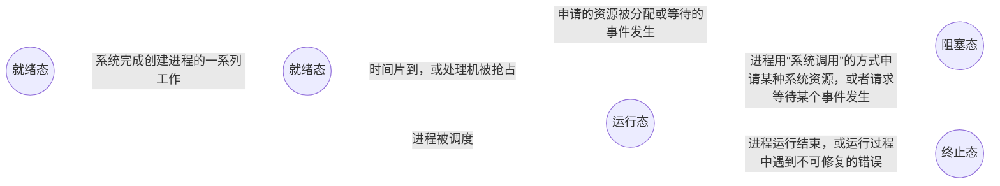

$$进程$$

# 一、进程的概念
**程序** 是 **静态** 的，就是一个存放在磁盘里的可执行文件，就是一系列的指令集合。

**进程（Process）** 是 **动态** 的，是程序的一次执行过程。同一个程序多次执行会对应多个进程。

当进程被创建时，操作系统会为该进程分配一个 **唯一的、不重复的** 的“身份证号”-- **PID**（Process ID，进程ID）。

引入进程的 **目的** 是更好的使多道程序并发执行，提高资源利用率和系统吞吐量。

# 二、进程的组成

**进程** 是进程实体的 **运行过程**，是一个独立的运行单位，也是操作系统进行 **资源分配** 和 **调度（指操作系统决定让哪个进程上 CPU 运行）** 的 **基本单位**。

一个 **进程实体（进程映像）** 由 **进程控制块（PCB）**、**程序段**、**数据段** 三部分组成。

**进程** 是 **动态** 的，**进程实体（进程映像）** 是 **静态** 的。

进程实体反应了进程在某一时刻的状态。进程是进程实体的运行过程。

**PCB** 是给 **操作系统用的**；**程序段**、**数据段** 是给 **进程自己用的**，与进程自身的运行逻辑有关。

同一个程序运行多个，它们的 PCB、数据段各不相同，但程序段的内容是相同的。

## （一）进程控制块（PCB）
**进程控制块（PCB）** 是为了使参与并发执行的每个程序（含数据）都能独立运行，而配置的一个专门的数据结构。

**PCB** 是 **进程存在的唯一标识**。
进程 **创建时**，操作系统为其创建 PCB；
进程 **执行时**，系统通过其 PCB 了解进程的现行运行状态，以便操作系统对其进行控制和管理；
进程 **结束时**，会回收其 PCB，该进程随之消亡。

- **PCB 主要包括**：
  - **进程描述信息**：进程标识符 PID、用户标识符 UID。让操作系统区分各个进程。
  - **进程控制和管理信息**：进程的运行情况。如：CPU、磁盘、网络流量使用情况；进程当前状态：就绪态/阻塞态/运行态。
  - **资源分配清单**：给进程分配了哪些资源（如：分配了多少内存、正在使用哪些 I/O 设备、正在使用哪些文件）。可用于实现操作系统对资源的管理。
  - **处理机相关信息（CPU 上下文）**：如 PSW、PC 等等各种寄存器的值（用于实现进程切换）。

进程的管理者（操作系统）所需的数据都在 PCB 中。

## （二）程序段
**程序段** 是能被进程调度程序调度到 CPU 执行的程序代码段。

*注意*：程序可被多个进程共享，即多个进程可以运行同一个程序。

## （三）数据段
**数据段** 包含运行过程中产生的各种数据。可以是进程对应的程序加工处理的原数据，也可以是程序执行时产生的中间或最终结果。

# 三、进程的特征
1. **动态性（最基本的特征）**：进程是程序的一次执行，是动态地产生、变化和消亡的。
2. **并发性**：内存中有多个进程，各进程可并发执行。
3. **独立性**：进程是一个能独立运行、**独立获得资源和独立接受调度的基本单位**。
4. **异步性**：各进程按各自独立的、不可预知的速度向前推进，操作系统要提供“进程同步机制”来解决异步问题。异步性会导致并发程序执行结果的不确定性。

# 四、进程的状态与转换

## （一）进程的状态

1. **创建态（新建态）**：创建进程时的状态。这个阶段操作系统会为进程分配资源、初始化 PCB。

2. **就绪态**：当进程创建完成后，便进入“就绪态”。处于就绪态的进程已具备运行条件，但由于没有空闲 CPU，就暂时不能运行。

3. **运行态**：如果一个进程此时在 CPU 上运行，那么这个进程处于 **运行态**。CPU 会执行该进程对应的程序（执行指令序列）。

4. **阻塞态（等待态）**：在进程运行的过程中，可能会 **请求等待某个事件的发生**（如等待某种系统资源的分配，或者等待其他进程的响应）。在这个事件发生之前，进程无法继续往下执行，此时操作系统会让这个进程下 CPU，并让它进入“**阻塞态**”。当 CPU 空闲时，又会选择另一个“就绪态”进程上 CPU 运行。

5. **终止态（结束态）**：一个进程可以执行 exit 系统调用，请求操作系统终止该进程。此时进程会进入“**终止态**”，操作系统会让该进程下 CPU，并回收内存空间等资源，最后还要回收该进程的 PCB。当终止进程的工作完成之后，这个进程就彻底消失了。

- 进程的生命周期中，大部分时间都处于三种 **基本状态**：**运行态**、**就绪态**、**阻塞态**。

- 单 CPU 情况下，同一时刻只会有一个进程处于运行态；多核 CPU 情况下，可能有多个进程处于运行态。

- **进程 PCB 中，会有一个变量 state 来表示进程的当前状态**。如：1 表示创建态、2 表示就绪态、3 表示运行态等等。

- 为了对同一个状态下的各个进程进行统一的管理，操作系统会将各个进程的 PCB 组织起来。常用的 **组织方式** 有 **链接方式** 和 **索引方式** 两种。
  - **链接方式**：将同一状态的 PCB 链接成一个队列，不同状态对应不同的队列。如：
    - **执行指针** 指向当前处于运行态（执行态）的进程（单 CPU 计算机中，同一时刻只会有一个进程处于运行态）。
    - **就绪队列**，通常会把优先级高的进程放在队头。
    - **阻塞队列** 可以将处于阻塞态的进程的 PCB，根据其阻塞原因不同，再分为多个阻塞队列。
  - **索引方式**：将同一状态的进程组织在一个索引表中，索引表的表项指向相应的 PCB，不同状态对应不同的索引表。操作系统持有指向各个索引表的指针。

## （二）进程状态的转换

- **就绪态 $\rightarrow$ 运行态**：处于就绪态的进程被调度后，获得 CPU 资源（分派 CPU 的时间片），于是进程由就绪态转换为运行态。

- **运行态 $\rightarrow$ 就绪态**：处于运行态的进程在时间片用完后，不得不让出 CPU，从而进程由运行态转换为就绪态。此外，在可剥夺的操作系统中，当有更高优先级的进程就绪时，调度程序将正在执行的进程转换为就绪态，让更高优先级的进程执行。

- **运行态 $\rightarrow$ 阻塞态**：进程请求某一资源的使用和分配或等待某一事件的发生时，它就从运行态转换为阻塞态。进程以系统调用的形式请求操作系统提供服务，这是一种特殊的、由运行用户态程序调用操作系统内核过程的形式。

- **阻塞态 $\rightarrow$ 就绪态**：进程等待的事件到来时，中断处理程序必须将相应进程的状态由阻塞态转换为就绪态。

- **创建态 $\rightarrow$ 就绪态**：系统完成创建进程相关的工作。

- **运行态 $\rightarrow$ 终止态**：进程运行结束，或运行过程中遇到不可修复的错误。

**注意**：
1. **不能由阻塞态直接转换为运行态，也不能由就绪态直接转换为阻塞态**（因为进入阻塞态是进程主动请求的，必然需要进程在运行时才能发出这种请求）
2. 一个进程从运行态变为阻塞态是主动的行为，而从阻塞态变为就绪态是被动的行为，需要其他相关进程的协助。

# 五、进程控制

**进程控制** 的主要功能是对系统中的所有进程实施有效的管理，它具有 **创建新进程**、**撤销已有进程**、实现 **进程状态转换**等功能。

用 **原语（执行期间不允许中断）来实现进程控制**。原语的 **原子性** 可以用“**关中断指令**”和“**开中断指令**”这两个 **特权指令** 实现。
  - CPU 执行了 **关中断指令** 之后，就 **不再例行检查外部中断信号**，直到执行 **开中断指令** 之后才会 **恢复检查**。

## （一）进程的创建
**创建原语**：操作系统创建一个新进程时使用的原语。

- **创建原语过程** 如下：
  1. 为新进程分配一个唯一的 **进程标识号**，并申请一个 **空白 PCB**。若 PCB 申请失败，则创建失败。
  2. **为新进程分配所需资源**。
  3. **初始化 PCB**：初始化标志信息、初始化 CPU 状态信息、初始化 CPU 控制信息、设置进程的优先级。
  4. 若进程就绪队列能够接纳新进程，则 **将 PCB 插入就绪队列**，等待被调度运行。

- **引起进程创建的事件** 有：
  - **用户登录**：终端用户登录系统成功，系统会为其建立一个新的进程。
  - **作业调度**：有新的作业放入内存时，会为其建立一个新的进程。
  - **系统提供服务**：用户向操作系统提出某些请求时，会新建一个进程来处理该请求。
  - **用户程序的应用请求**：由用户进程主动请求创建一个子进程。

## （二）进程的终止

**终止原语**：操作系统终止进程时使用的原语。

- **终止原语过程** 如下：
    1. 根据被终止进程的标识符，**从 PCB 集合中检查出该进程的 PCB**，从中读出该进程的状态。
    2. **若进程正在运行，立即剥夺 CPU，将 CPU 分配给其他进程**。
    3. 若该进程还有子孙进程，则 **终止其所有子孙进程**。
    4. **将该进程拥有的所有资源归还给父进程或操作系统**。
    5. **将该 PCB 从所在队列（链表）中删除**。
 - **子进程** 可以继承 **父进程** 所拥有的资源。当子进程终止时，应将其从父进程那里获得的资源还给父进程。
 - 进程之间的关系是树形结构。

- **引起进程终止的事件** 有：
  - **正常结束**：进程的任务已完成并准备退出运行，即进程自己请求终止（exit 系统调用）。
  - **异常结束**：进程在运行时，发生了某种异常事件，使程序无法继续运行。
  - **外界干预**：进程外界的请求而终止运行。如：用户打开任务管理器终止进程。

## （三）进程的阻塞

**阻塞原语**：进程从运行态转换为阻塞态时使用的原语。

- **阻塞原语过程** 如下：
  1. **找到要阻塞的进程的标识号（PID）对应的 PCB**。
  2. **保护进程运行现场，将其状态转为阻塞态，暂时停止进程运行**。
  3. **将 PCB 插入相应事件的等待队列**，将 CPU 资源调度给其他就绪进程。

- **引起进程阻塞的事件** 有：
  - 需要等待系统分配某种资源。
  - 需要等待相互合作的其他进程完成工作。

- 阻塞是进程自身的一种 **主动行为**。

## （四）进程的唤醒

**唤醒原语**：当被阻塞进程所期待的事件出现时，将等待该事件的进程唤醒的原语。

- **唤醒原语过程** 如下：
  1. **在事件等待队列中找到相应进程的 PCB**。
  2. **将 PCB 从等待队列移除，设置进程为就绪态**。
  3. **将 PCB 插入就绪队列，等待调度进程被调度**。

- **引起进程唤醒的事件**：等待的事件发生。（因何事阻塞，就应由何事唤醒）

**注意**：**唤醒原语** 和 **阻塞原语** 必须 **成对使用**。

## （五）进程的切换

**切换原语**：将此时处于运行态的进程移下 CPU，回到就绪队列或阻塞队列，并从就绪队列中处于就绪态的进程上 CPU 的原语。

- **切换原语过程** 如下：
  1. 挂起一个进程，**将运行环境信息（CPU 上下文）存入 PCB**，包括程序计数器和其他寄存器。
  2. 将进程的 **PCB 移入相应队列**。
  3. **选择另一个进程执行，并更新其 PCB**。
  4. **根据新进程的 PCB 恢复新进程所需的运行环境（CPU 上下文）**。
  5. **跳转到新进程 PCB 中的程序计数器所指向的位置执行**。

- **引起进程切换的事件** 有：
  - 当前进程时间片到
  - 有更高优先级的进程到达
  - 当前进程主动阻塞
  - 当前进程终止

# 六、进程的通信

**进程通信（IPC）**：指进程间的信息交换（产生的数据交互）。

为了保证安全，**一个进程不能直接访问另一个进程的地址空间**。

**进程通信方式**有 **低级通信方式**（如 PV 操作）、**高级通信方式（以较高的效率传输大量数据的通讯方式）**。

**高级通信方式** 主要有三类：**共享存储**、**消息传递**、**管道通信**。

## （一）共享存储
在通信的进程之间存在一块可直接访问的 **共享空间**，并映射到进程的虚拟地址空间，通过 **对这片共享空间进行读/写操作** 实现进程之间的信息交换。

- 为避免出错，各个进程对共享空间的 **访问** 应该是 **互斥** 的）。
- **各个进程自己负责实现互斥**，可以使用操作系统内核提供的 **同步互斥工具（如 P、V 操作）**。

- 共享存储有分为两种：
  1. **低级方式的共享** 是 **基于数据结构** 的共享，速度慢，限制多；
  2. **高级方式的共享** 是 **基于存储区** 的共享，操作系统在内存中划出一块共享存储区，数据的形式、存放位置都由通信进程控制，而不是操作系统。速度很快，灵活性高。

## （二）消息传递
进程间的数据交换以 **格式化的消息** 为单位。进程通过操作系统提供的“**发送消息/接收消息**”两个 **原语** 进行数据交换。

- **格式化的消息** 由两部分组成：
  - **消息头**：包括发送进程 ID、接受进程 ID、消息长度等格式化的信息。
  - **消息体** 包括具体的要传送给另一个进程的数据。

- 消息传递又可分为 **直接通信方式** 和 **间接通信方式**。
  - **直接通信方式**：消息发送进程要指明接收进程的 ID，直接将消息发送给接收进程。并将它 **挂在接收进程的消息缓冲队列上**，接收进程从消息缓冲队列中取得消息。
  - **间接通信方式（信箱通信方式）**：通过“信箱”间接地通信。发送进程 **将消息发送到某个中间实体**（一般称为“**信箱**”），接受进程从信箱中取得消息。
  可以多个进程往同一个信箱发送消息，也可以多个进程从同一个信箱中接收消息。

## （三）管道通信

**管道（pipe 文件）** 是 **一个特殊的共享文件。其实就是在内存中开辟一个大小固定的内存缓冲区（循环队列）**，数据在管道中是 **先进先出** 的（不如共享存储自由）。

**管道通信** 允许两个进程按生产者-消费者方式进行通信，**只要管道不满，写进程就能向管道的一端写入数据**；**只要管道非空，读进程就能从管道的一端读出数据**。

- 管道只能采用 **半双工通信**，某一时间段内只能实现单向的传输。如果要实现 **双向同时通信**，则 **需要设置两个管道**。

- 各进程要 **互斥** 地访问管道（由操作系统实现）。

- 当 **管道写满** 时，**写进程** 将 **阻塞**，直到读进程将管道中的数据取走，即可唤醒写进程。

- 当 **管道读空** 时，**读进程** 将 **阻塞**，直到写进程往管道中写入数据，即可唤醒读进程。

- 管道中的数据一旦被读出，就彻底消失。因此，当多个进程读同一个管道时，可能会错乱。对此，通常有两种解决方案：
  - **一个管道运行多个写进程，一个读进程**。（教材给出）
  - 允许 **多个写进程，多个读进程**，但系统会让各个读进程轮流从管道中读数据。（Linux 的方案）

- 管道只能由创建管道的进程访问，当父进程创建一个管道后，子进程会继承父进程的打开文件（管道是一种特殊文件），因此子进程也继承父进程的管道，并可用它来与父进程进行通信。

## （四）信号

**信号（signal）** 是用于 **通知进程发生了某个事件** 的机制（算是进程间通信的一种机制）。不同的系统事件对应不同的信号类型，每类信号对应一个序号。**进程收到一个信号后，对该信号进行处理**。

- 不同的操作系统对信号类型的定义各不相同。

在 **进程的 PCB 中**，**用至少 n 位向量，对应 n 种信号** 记录该进程的 **待处理信号**。若给某个进程发送一个信号，则把该类信号对应的位修改为 1。一旦该信号被处理，就把对应的位修改为 0。**用另一个 n 位向量记录被阻塞（屏蔽）的信号**，当某个位为 1 时，表示该位对应的信号类型将被进程忽略，无需响应。

1. 信号的 **发送** 主要由两种方式：
   - **内核给某个进程发送信号**：当系统检测到某个特定的系统事件时，就给进程发送信号。
   - **一个进程给另一个进程发送信号**：进程可以调用 kill 函数，要求内核发送一个信号给目的进程（需指明接收进程的 PID 和信号的序号）。进程也可以也自己发送信号。
*注意*：进程之间允许发送的信号类型是有限的。操作系统内核给用户进程发送信号没有限制。

1. 信号的 **处理**
   - 信号的 **处理时机**：当 **进程从内核态转为用户态时**，会 **检查** 该进程 **是否有** 未被阻塞的 **待处理信号**，若有，则强制进程接收信号，并立即 **处理信号**（若有多个待处理信号，则先处理序号更小的信号）。
   - 信号的 **处理方式** 有两种：
     - **执行默认的信号处理程序**（操作系统为每类信号预设了默认的信号处理程序）。
     - **执行进程定义的信号处理程序**。进程可以为某类信号自定义信号处理程序（自定义信号处理程序将覆盖默认的信号处理程序）。
   - 信号处理程序运行结束后，通常会返回进程的下一条指令继续执行（除非信号处理程序将进程阻塞或终止）。
   - 重复收到的同类信号，将被简单的丢弃（因为仅用 1 bit 记录一类待处理信号）。
   - 各个进程可以有各自的自定义信号处理程序。
   - **有些信号既不能被用户自定义处理函数，也不能被阻塞**。

- 信号与异常的关系
  - **信号** 可以作为 **异常** 的 **配套机制**，**让进程对操作系统的异常处理进行补充**。
  - 在进程运行过程中，某些特殊事件可能引发异常，操作系统内核负责捕获并处理异常。
    - 有些异常可以由内核完成全部处理，此时就不必再使用信号机制。
    - **有些异常无法由内核完成全部处理，可能还需要用户进程配合**，此时就可以用信号机制与异常机制相互配合。